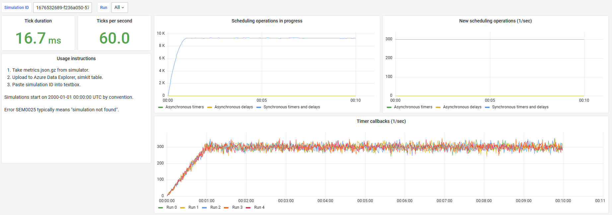

# Simkit

Say that you are working on some complex piece of software engineering, for example a load balancer. You want to test it. What do you need?

* The test scenario needs to run at least 10 minutes to ensure it does not degrade over time, some cases perhaps even 24 hours.
* You may want to evaluate behavior under different conditions (steady load, spiky load, misbehaving clients, ...).
* Executing the same scenario multiple times should yield equivalent results - the behavior must be stable.
* You want to validate what happens when the environment changes (e.g. some servers become unhealthy and refuse traffic).

To do all of this manually would be so slow, expensive and complicated that few would bother and justifiably so.

**Simkit is a framework for creating fast and accurate simulations that can validate such complex scenarios as part of an automated test suite.**

# Quick start

Prerequisites:

* .NET 7+

Steps to follow:

1. `nuget install Simkit`
1. In your test method, create an instance of `SimulationParameters` and `Simulator`.
1. Register any services via `ConfigureServices`.
1. Call `Simulator.ExecuteAsync()`.
1. After performing any scenario setup (to simulate inputs and observe outputs), call `ISimulation.ExecuteAsync()`.
1. Assert that the observed outputs indicate scenario success.

```
[TestMethod]
public async Task TickCounter_CountsTicksAtExpectedRate()
{
    var parameters = new SimulationParameters();
    var simulator = new Simulator(parameters);

    simulator.ConfigureServices(services =>
    {
        services.AddSingleton<TickCounter>();
    });

    await simulator.ExecuteAsync(async (simulation, cancel) =>
    {
        var tickCounter = simulation.GetRequiredService<TickCounter>();
        tickCounter.Start();

        await simulation.ExecuteAsync();

        // Validate results - did the simulated scenario actually succeed?
        // The counter counts one tick per second, so that's how much we expect to see after the simulation is completed.
        Assert.AreEqual((int)parameters.SimulationDuration.TotalSeconds, tickCounter.Ticks);
    }, CancellationToken.None);
}
```

For reference, see [TickCounter_CountsTicksAtExpectedRate()](Tests/SimulatorTests.cs).

# Time

The simulator does not run in real time - it runs much faster. The code under test is expected to use the [ITime interface](Simkit/ITime.cs) for all its clock/timer/delay needs, replacing built-in .NET features such as `Task.Delay`, `PeriodicTimer` and `DateTimeOffset.UtcNow`. The [RealTime class](Simkit/RealTime.cs) provides an implementation suitable for real-time production code.

For optimal simulation performance, synchronous callbacks (at least `ValueTask`) should be preferred over asynchronous `Task` returning callbacks whereever possible.

# Telemetry

Telemetry artifacts are stored a `SimulationArtifacts` subdirectory, created in the current working directory. Each subdirectory is named after the (automatically generated) simulation ID, to uniquely identify each simulation.


Any `ILogger` output is written to a log file. The simulator executes multiple runs of each simulation for comparison, each of which gets its own log file.

The simulator supports metrics export via the `IMetricFactory` interface provided by the simulation engine. Metrics data is exported once per second in a format suitable for analysis via Azure Data Explorer, as a `metrics.json.gz` file. This file contains metrics of all the runs.

# Metrics analysis

1. Create an Azure Data Explorer cluster and database.
1. On [dataexplorer.azure.com](https://dataexplorer.azure.com/), go to Data -> Ingest and pick either a new or existing table to import into (recommended table name `simkit`).
    
1. Upload one or more `metrics.json.gz` files from the simulations of interest.
1. Just hit "Next" when the ingest wizard asks you anything, the defaults are all fine.
1. Wait for the happy news that data ingestion is completed (should take less than a minute).
    

Now what? Well, that is up to you - you can start querying and making use of the metrics. This is your data and how you use it to extract valuable insights is up to you.

The recommended visualization platform to connect Azure Data Explorer to is Grafana, although Azure Data Explorer also has rudimentary visualization capabilities in its own GUI, which may be sufficient depending on your use case.

# Example Grafana dashboards


[Load balancer simulation](Docs/Dashboard-LoadBalancer.json) visualizes the status of the load balanced requests from [LoadBalancerDemoScenarios.cs](Tests/LoadBalancerDemoScenarios.cs).



[Simulation engine](Docs/Dashboard-Engine.json) visualizes the state of the simulation engine, with a focus on the time logic. This allows you to observe the internals of the simulator, such as how many timers are registered and of what type they are.